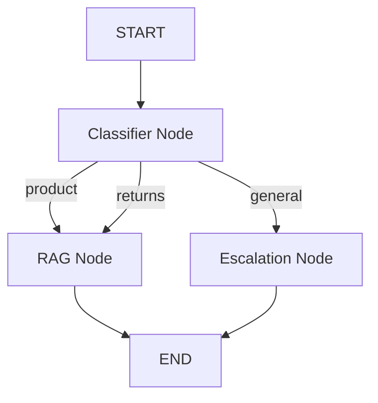

# TechGear Electronics Customer Support Bot - Design Document

## Project Overview
A Retrieval Augmented Generation (RAG) chatbot for TechGear Electronics customer support, built with LangChain, ChromaDB, LangGraph, Google Gemini, and FastAPI.

---

## Architecture Diagram

```
┌─────────────────────────────────────────────────────────────────┐
│                         User Interface                           │
│                      (FastAPI POST /chat)                        │
└────────────────────────────┬────────────────────────────────────┘
                             │
                             ▼
┌─────────────────────────────────────────────────────────────────┐
│                      LangGraph Workflow                          │
│  ┌──────────────┐   ┌──────────────┐   ┌──────────────┐       │
│  │  Classifier  │──▶│  RAG Node    │──▶│   Response   │       │
│  │     Node     │   │              │   │              │       │
│  └──────┬───────┘   └──────────────┘   └──────────────┘       │
│         │                                                        │
│         └──────────────▶┌──────────────┐                       │
│                         │  Escalation  │                        │
│                         │     Node     │                        │
│                         └──────────────┘                        │
└────────────────────────────┬────────────────────────────────────┘
                             │
                             ▼
┌─────────────────────────────────────────────────────────────────┐
│                      RAG Pipeline                                │
│  ┌──────────────┐   ┌──────────────┐   ┌──────────────┐       │
│  │   Retriever  │──▶│  Context     │──▶│  Gemini LLM  │       │
│  │  (ChromaDB)  │   │  Formatting  │   │              │       │
│  └──────────────┘   └──────────────┘   └──────────────┘       │
└─────────────────────────────────────────────────────────────────┘
                             │
                             ▼
┌─────────────────────────────────────────────────────────────────┐
│                     Knowledge Base                               │
│  ┌──────────────┐   ┌──────────────┐   ┌──────────────┐       │
│  │ product_info │──▶│   Chunking   │──▶│  Embeddings  │       │
│  │    .txt      │   │              │   │  (Gemini)    │       │
│  └──────────────┘   └──────────────┘   └──────┬───────┘       │
│                                                 │                │
│                                                 ▼                │
│                                        ┌──────────────┐         │
│                                        │   ChromaDB   │         │
│                                        │ Vector Store │         │
│                                        └──────────────┘         │
└─────────────────────────────────────────────────────────────────┘
```

---

## Step-by-Step Implementation Flow

### STEP 1: Environment & Project Setup

**Objective:** Set up Python project structure with required dependencies

**Directory Structure:**
```
CSC_for_TechGear_Electronics/
├── src/
│   ├── __init__.py
│   ├── main.py                    # FastAPI application
│   ├── config.py                  # Configuration settings
│   ├── knowledge_base/
│   │   ├── __init__.py
│   │   ├── loader.py              # Load documents
│   │   └── chunker.py             # Text chunking
│   ├── embeddings/
│   │   ├── __init__.py
│   │   └── gemini_embeddings.py   # Gemini embeddings
│   ├── vectorstore/
│   │   ├── __init__.py
│   │   └── chromadb_store.py      # ChromaDB operations
│   ├── retriever/
│   │   ├── __init__.py
│   │   └── document_retriever.py  # Retrieval logic
│   ├── rag/
│   │   ├── __init__.py
│   │   └── rag_chain.py           # RAG pipeline
│   ├── graph/
│   │   ├── __init__.py
│   │   ├── state.py               # LangGraph state
│   │   ├── nodes.py               # Graph nodes
│   │   └── workflow.py            # LangGraph workflow
│   └── api/
│       ├── __init__.py
│       ├── routes.py              # FastAPI routes
│       └── schemas.py             # Pydantic models
├── data/
│   └── product_info.txt           # Knowledge base
├── chroma_db/                     # Persistent vector store
├── .env                           # Environment variables
├── .env.example
├── requirements.txt
├── setup.py
└── README.md
```

**Dependencies (requirements.txt):**
```
langchain==0.1.20
langchain-google-genai==1.0.1
langchain-community==0.0.38
chromadb==0.4.24
langgraph==0.0.55
fastapi==0.110.0
uvicorn==0.27.1
pydantic==2.6.3
pydantic-settings==2.2.1
python-dotenv==1.0.1
tiktoken==0.6.0
```

**Environment Variables (.env):**
```
GEMINI_API_KEY=your_api_key_here
CHROMA_PERSIST_DIRECTORY=./chroma_db
CHROMA_COLLECTION_NAME=techgear_knowledge
MODEL_NAME=gemini-pro
EMBEDDING_MODEL=models/embedding-001
CHUNK_SIZE=300
CHUNK_OVERLAP=50
TOP_K_RESULTS=3
```

**Implementation Files:**
- `src/config.py` - Load and validate environment variables
- `setup.py` - Package configuration

---

### STEP 2: Prepare Knowledge Base

**Objective:** Create structured product information file

**File:** `data/product_info.txt`

**Content Structure:**
```
Product: SmartWatch Pro X
Price: ₹15,999
Features: Heart rate monitoring, GPS tracking, 7-day battery life, Water resistant up to 50m
Warranty: 1 year standard warranty, Extended 2-year warranty available for ₹1,999

Product: Wireless Earbuds Elite
Price: ₹4,999
Features: Active Noise Cancellation (ANC), 24-hour battery life, Bluetooth 5.2
Warranty: 6 months standard warranty

Product: Power Bank Ultra 20000mAh
Price: ₹2,499
Features: Fast charging 22.5W, USB-C and USB-A ports
Warranty: 1 year standard warranty

Return Policy:
- 7-day no-questions-asked return policy
- Full refund processed in 5-7 business days
- Product must be in original condition with all accessories

Support Information:
- Support Hours: Monday to Saturday, 9 AM to 6 PM IST
- Email: support@techgear.com
- Phone: 1800-123-4567
```

**Validation:**
- Ensure consistent formatting
- Include all product details
- Clear policy statements

---

### STEP 3: Load Knowledge Base Using LangChain

**Objective:** Load and verify knowledge base documents

**File:** `src/knowledge_base/loader.py`

**Implementation:**
```python
from langchain_community.document_loaders import TextLoader
from pathlib import Path
import logging

logger = logging.getLogger(__name__)

class KnowledgeBaseLoader:
    def __init__(self, file_path: str):
        self.file_path = Path(file_path)
        
    def load_documents(self):
        """Load documents from text file"""
        try:
            loader = TextLoader(str(self.file_path), encoding='utf-8')
            documents = loader.load()
            
            logger.info(f"Loaded {len(documents)} documents from {self.file_path}")
            logger.info(f"First document preview: {documents[0].page_content[:200]}...")
            
            return documents
        except Exception as e:
            logger.error(f"Error loading documents: {e}")
            raise

# Usage
if __name__ == "__main__":
    loader = KnowledgeBaseLoader("data/product_info.txt")
    docs = loader.load_documents()
    print(f"Total documents: {len(docs)}")
    for i, doc in enumerate(docs):
        print(f"\nDocument {i+1}:")
        print(f"Content: {doc.page_content[:500]}...")
```

**Expected Output:**
```
Loaded 1 documents from data/product_info.txt
First document preview: Product: SmartWatch Pro X
Price: ₹15,999
Features: Heart rate monitoring...
```

---

### STEP 4: Text Chunking

**Objective:** Split documents into overlapping chunks for better retrieval

**File:** `src/knowledge_base/chunker.py`

**Configuration:**
- Chunk size: 300 characters
- Chunk overlap: 50 characters
- Splitter: RecursiveCharacterTextSplitter

**Implementation:**
```python
from langchain.text_splitter import RecursiveCharacterTextSplitter
from typing import List
from langchain.schema import Document
import logging

logger = logging.getLogger(__name__)

class DocumentChunker:
    def __init__(self, chunk_size: int = 300, chunk_overlap: int = 50):
        self.chunk_size = chunk_size
        self.chunk_overlap = chunk_overlap
        self.text_splitter = RecursiveCharacterTextSplitter(
            chunk_size=chunk_size,
            chunk_overlap=chunk_overlap,
            length_function=len,
            separators=["\n\n", "\n", " ", ""]
        )
        
    def chunk_documents(self, documents: List[Document]) -> List[Document]:
        """Split documents into chunks"""
        try:
            chunks = self.text_splitter.split_documents(documents)
            
            logger.info(f"Created {len(chunks)} chunks from {len(documents)} documents")
            logger.info(f"Chunk size: {self.chunk_size}, Overlap: {self.chunk_overlap}")
            
            # Log sample chunks
            for i, chunk in enumerate(chunks[:3]):
                logger.info(f"Chunk {i+1}: {chunk.page_content[:100]}...")
            
            return chunks
        except Exception as e:
            logger.error(f"Error chunking documents: {e}")
            raise

# Usage
if __name__ == "__main__":
    from src.knowledge_base.loader import KnowledgeBaseLoader
    
    loader = KnowledgeBaseLoader("data/product_info.txt")
    docs = loader.load_documents()
    
    chunker = DocumentChunker(chunk_size=300, chunk_overlap=50)
    chunks = chunker.chunk_documents(docs)
    
    print(f"Total chunks: {len(chunks)}")
    for i, chunk in enumerate(chunks[:5]):
        print(f"\n--- Chunk {i+1} ---")
        print(chunk.page_content)
```

**Expected Output:**
```
Created 15 chunks from 1 documents
Chunk 1: Product: SmartWatch Pro X
Price: ₹15,999...
Chunk 2: Features: Heart rate monitoring, GPS tracking...
```

---

### STEP 5: Create Embeddings with Google Gemini

**Objective:** Generate vector embeddings using Gemini embedding model

**File:** `src/embeddings/gemini_embeddings.py`

**Implementation:**
```python
from langchain_google_genai import GoogleGenerativeAIEmbeddings
from typing import List
import logging
import os

logger = logging.getLogger(__name__)

class GeminiEmbeddingService:
    def __init__(self, api_key: str, model_name: str = "models/embedding-001"):
        self.api_key = api_key
        self.model_name = model_name
        self.embeddings = GoogleGenerativeAIEmbeddings(
            model=model_name,
            google_api_key=api_key
        )
        
    def embed_documents(self, texts: List[str]) -> List[List[float]]:
        """Generate embeddings for multiple documents"""
        try:
            logger.info(f"Generating embeddings for {len(texts)} documents")
            embeddings = self.embeddings.embed_documents(texts)
            logger.info(f"Generated {len(embeddings)} embeddings")
            logger.info(f"Embedding dimension: {len(embeddings[0])}")
            return embeddings
        except Exception as e:
            logger.error(f"Error generating embeddings: {e}")
            raise
    
    def embed_query(self, text: str) -> List[float]:
        """Generate embedding for a single query"""
        try:
            embedding = self.embeddings.embed_query(text)
            return embedding
        except Exception as e:
            logger.error(f"Error embedding query: {e}")
            raise

# Usage
if __name__ == "__main__":
    from dotenv import load_dotenv
    load_dotenv()
    
    api_key = os.getenv("GEMINI_API_KEY")
    service = GeminiEmbeddingService(api_key)
    
    # Test embedding
    test_texts = [
        "SmartWatch Pro X features",
        "Return policy information"
    ]
    embeddings = service.embed_documents(test_texts)
    print(f"Generated {len(embeddings)} embeddings")
    print(f"Embedding dimension: {len(embeddings[0])}")
```

**Security Considerations:**
- Never hardcode API keys
- Use environment variables
- Implement rate limiting
- Handle API errors gracefully

---

### STEP 6: Store Embeddings in ChromaDB

**Objective:** Create persistent vector database for embeddings

**File:** `src/vectorstore/chromadb_store.py`

**Implementation:**
```python
import chromadb
from chromadb.config import Settings
from langchain_community.vectorstores import Chroma
from langchain.schema import Document
from typing import List
import logging
from pathlib import Path

logger = logging.getLogger(__name__)

class ChromaDBStore:
    def __init__(self, persist_directory: str, collection_name: str, embedding_function):
        self.persist_directory = Path(persist_directory)
        self.collection_name = collection_name
        self.embedding_function = embedding_function
        
        # Create directory if it doesn't exist
        self.persist_directory.mkdir(parents=True, exist_ok=True)
        
        self.vectorstore = None
        
    def create_vectorstore(self, documents: List[Document]):
        """Create and persist vector store"""
        try:
            logger.info(f"Creating vector store with {len(documents)} documents")
            
            self.vectorstore = Chroma.from_documents(
                documents=documents,
                embedding=self.embedding_function,
                collection_name=self.collection_name,
                persist_directory=str(self.persist_directory)
            )
            
            logger.info(f"Vector store created and persisted to {self.persist_directory}")
            return self.vectorstore
            
        except Exception as e:
            logger.error(f"Error creating vector store: {e}")
            raise
    
    def load_vectorstore(self):
        """Load existing vector store"""
        try:
            logger.info(f"Loading vector store from {self.persist_directory}")
            
            self.vectorstore = Chroma(
                collection_name=self.collection_name,
                embedding_function=self.embedding_function,
                persist_directory=str(self.persist_directory)
            )
            
            logger.info("Vector store loaded successfully")
            return self.vectorstore
            
        except Exception as e:
            logger.error(f"Error loading vector store: {e}")
            raise
    
    def get_vectorstore(self):
        """Get vector store (load if exists, create if not)"""
        if self.persist_directory.exists() and list(self.persist_directory.iterdir()):
            return self.load_vectorstore()
        else:
            raise ValueError("Vector store not found. Please create it first.")

# Usage
if __name__ == "__main__":
    from src.knowledge_base.loader import KnowledgeBaseLoader
    from src.knowledge_base.chunker import DocumentChunker
    from src.embeddings.gemini_embeddings import GeminiEmbeddingService
    from dotenv import load_dotenv
    import os
    
    load_dotenv()
    
    # Load and chunk documents
    loader = KnowledgeBaseLoader("data/product_info.txt")
    docs = loader.load_documents()
    
    chunker = DocumentChunker(chunk_size=300, chunk_overlap=50)
    chunks = chunker.chunk_documents(docs)
    
    # Create embeddings
    api_key = os.getenv("GEMINI_API_KEY")
    embedding_service = GeminiEmbeddingService(api_key)
    
    # Create vector store
    store = ChromaDBStore(
        persist_directory="./chroma_db",
        collection_name="techgear_knowledge",
        embedding_function=embedding_service.embeddings
    )
    vectorstore = store.create_vectorstore(chunks)
    
    print(f"Vector store created with {vectorstore._collection.count()} documents")
```

**Persistence Benefits:**
- No need to re-embed on restart
- Faster application startup
- Reduced API calls
- Cost savings

---

### STEP 7: Create a Retriever

**Objective:** Build retriever to fetch top-K relevant chunks

**File:** `src/retriever/document_retriever.py`

**Configuration:**
- Top K results: 3
- Search type: Similarity
- Score threshold: Optional

**Implementation:**
```python
from langchain.schema import BaseRetriever
from typing import List
import logging

logger = logging.getLogger(__name__)

class TechGearRetriever:
    def __init__(self, vectorstore, top_k: int = 3):
        self.vectorstore = vectorstore
        self.top_k = top_k
        self.retriever = vectorstore.as_retriever(
            search_type="similarity",
            search_kwargs={"k": top_k}
        )
        
    def retrieve(self, query: str) -> List[str]:
        """Retrieve top-k relevant documents"""
        try:
            logger.info(f"Retrieving documents for query: {query}")
            
            docs = self.retriever.get_relevant_documents(query)
            
            logger.info(f"Retrieved {len(docs)} documents")
            for i, doc in enumerate(docs):
                logger.info(f"Document {i+1}: {doc.page_content[:100]}...")
            
            return docs
            
        except Exception as e:
            logger.error(f"Error retrieving documents: {e}")
            raise
    
    def get_retriever(self) -> BaseRetriever:
        """Get the retriever object"""
        return self.retriever

# Usage
if __name__ == "__main__":
    from src.vectorstore.chromadb_store import ChromaDBStore
    from src.embeddings.gemini_embeddings import GeminiEmbeddingService
    from dotenv import load_dotenv
    import os
    
    load_dotenv()
    
    api_key = os.getenv("GEMINI_API_KEY")
    embedding_service = GeminiEmbeddingService(api_key)
    
    store = ChromaDBStore(
        persist_directory="./chroma_db",
        collection_name="techgear_knowledge",
        embedding_function=embedding_service.embeddings
    )
    vectorstore = store.load_vectorstore()
    
    retriever = TechGearRetriever(vectorstore, top_k=3)
    
    # Test retrieval
    test_query = "What is the price of SmartWatch Pro X?"
    docs = retriever.retrieve(test_query)
    
    print(f"\nQuery: {test_query}")
    print(f"Retrieved {len(docs)} documents:\n")
    for i, doc in enumerate(docs):
        print(f"--- Document {i+1} ---")
        print(doc.page_content)
        print()
```

**Expected Output:**
```
Query: What is the price of SmartWatch Pro X?
Retrieved 3 documents:

--- Document 1 ---
Product: SmartWatch Pro X
Price: ₹15,999
Features: Heart rate monitoring...
```

---

### STEP 8: Build RAG Chain with Gemini

**Objective:** Create RAG pipeline with Gemini Pro LLM

**File:** `src/rag/rag_chain.py`

**Components:**
- Retriever: Fetch relevant context
- LLM: Gemini Pro
- Prompt Template: Structured prompt
- Output Parser: Format response

**Implementation:**
```python
from langchain_google_genai import ChatGoogleGenerativeAI
from langchain.prompts import PromptTemplate
from langchain.chains import RetrievalQA
from langchain.schema.runnable import RunnablePassthrough
from langchain.schema.output_parser import StrOutputParser
import logging

logger = logging.getLogger(__name__)

class RAGChain:
    def __init__(self, retriever, api_key: str, model_name: str = "gemini-pro"):
        self.retriever = retriever
        self.llm = ChatGoogleGenerativeAI(
            model=model_name,
            google_api_key=api_key,
            temperature=0.3,
            convert_system_message_to_human=True
        )
        
        self.prompt_template = """You are a helpful customer support assistant for TechGear Electronics.
Use ONLY the following context to answer the question. If the answer is not in the context, say "I don't have that information in my knowledge base. Please contact support@techgear.com for assistance."

Context:
{context}

Question: {question}

Answer (be concise and helpful):"""

        self.prompt = PromptTemplate(
            template=self.prompt_template,
            input_variables=["context", "question"]
        )
        
        self.chain = self._create_chain()
    
    def _create_chain(self):
        """Create the RAG chain"""
        def format_docs(docs):
            return "\n\n".join([doc.page_content for doc in docs])
        
        chain = (
            {
                "context": self.retriever | format_docs,
                "question": RunnablePassthrough()
            }
            | self.prompt
            | self.llm
            | StrOutputParser()
        )
        
        return chain
    
    def query(self, question: str) -> str:
        """Query the RAG chain"""
        try:
            logger.info(f"RAG query: {question}")
            response = self.chain.invoke(question)
            logger.info(f"RAG response: {response[:100]}...")
            return response
        except Exception as e:
            logger.error(f"Error in RAG query: {e}")
            raise

# Usage
if __name__ == "__main__":
    from src.retriever.document_retriever import TechGearRetriever
    from src.vectorstore.chromadb_store import ChromaDBStore
    from src.embeddings.gemini_embeddings import GeminiEmbeddingService
    from dotenv import load_dotenv
    import os
    
    load_dotenv()
    
    api_key = os.getenv("GEMINI_API_KEY")
    
    # Setup retriever
    embedding_service = GeminiEmbeddingService(api_key)
    store = ChromaDBStore(
        persist_directory="./chroma_db",
        collection_name="techgear_knowledge",
        embedding_function=embedding_service.embeddings
    )
    vectorstore = store.load_vectorstore()
    retriever_service = TechGearRetriever(vectorstore, top_k=3)
    retriever = retriever_service.get_retriever()
    
    # Create RAG chain
    rag = RAGChain(retriever, api_key)
    
    # Test queries
    queries = [
        "What is the price of SmartWatch Pro X?",
        "Explain the return policy",
        "What features does the Power Bank have?"
    ]
    
    for query in queries:
        print(f"\nQuery: {query}")
        response = rag.query(query)
        print(f"Response: {response}\n")
        print("-" * 80)
```

**Prompt Engineering:**
- Clear role definition
- Context-first approach
- Strict context adherence
- Fallback for unknown queries

---

### STEP 9: Define LangGraph State

**Objective:** Create state schema for conversation workflow

**File:** `src/graph/state.py`

**State Fields:**
- user_query: str
- category: str
- context: List[str]
- response: str

**Implementation:**
```python
from typing import TypedDict, List, Optional
from langgraph.graph import StateGraph

class ChatbotState(TypedDict):
    """State schema for chatbot workflow"""
    user_query: str
    category: str  # 'product', 'returns', 'general'
    context: Optional[List[str]]
    response: str

# Example state
def get_initial_state(user_query: str) -> ChatbotState:
    """Create initial state"""
    return {
        "user_query": user_query,
        "category": "",
        "context": None,
        "response": ""
    }
```

**State Flow:**
```
Initial State → Classifier → Category Assigned → 
Route to Node → Context Retrieved → Response Generated → Final State
```

---

### STEP 10: Create Query Classifier Node

**Objective:** Classify user queries into categories

**File:** `src/graph/nodes.py` (Part 1)

**Categories:**
- `product`: Product inquiries (price, features, specs)
- `returns`: Return/refund/warranty queries
- `general`: General inquiries, greetings, unrelated

**Implementation:**
```python
from src.graph.state import ChatbotState
import logging

logger = logging.getLogger(__name__)

class ClassifierNode:
    """Classify user queries into categories"""
    
    PRODUCT_KEYWORDS = [
        'price', 'cost', 'feature', 'spec', 'specification',
        'smartwatch', 'earbuds', 'power bank', 'battery',
        'buy', 'purchase', 'available', 'stock'
    ]
    
    RETURNS_KEYWORDS = [
        'return', 'refund', 'warranty', 'exchange',
        'replace', 'defective', 'broken', 'policy'
    ]
    
    def __call__(self, state: ChatbotState) -> ChatbotState:
        """Classify the user query"""
        query = state["user_query"].lower()
        
        logger.info(f"Classifying query: {query}")
        
        # Check for product keywords
        if any(keyword in query for keyword in self.PRODUCT_KEYWORDS):
            category = "product"
        # Check for returns keywords
        elif any(keyword in query for keyword in self.RETURNS_KEYWORDS):
            category = "returns"
        # Default to general
        else:
            category = "general"
        
        state["category"] = category
        logger.info(f"Query classified as: {category}")
        
        return state

# Usage
if __name__ == "__main__":
    from src.graph.state import get_initial_state
    
    classifier = ClassifierNode()
    
    test_queries = [
        "What is the price of SmartWatch Pro X?",
        "How do I return my earbuds?",
        "Hello, how are you?"
    ]
    
    for query in test_queries:
        state = get_initial_state(query)
        result = classifier(state)
        print(f"Query: {query}")
        print(f"Category: {result['category']}\n")
```

**Classification Logic:**
- Keyword-based matching
- Case-insensitive
- Priority: product > returns > general
- Extensible for ML-based classification

---

### STEP 11: Create RAG Response Node

**Objective:** Generate responses using RAG for product/returns queries

**File:** `src/graph/nodes.py` (Part 2)

**Implementation:**
```python
from src.graph.state import ChatbotState
from src.rag.rag_chain import RAGChain
import logging

logger = logging.getLogger(__name__)

class RAGNode:
    """Generate response using RAG chain"""
    
    def __init__(self, rag_chain: RAGChain):
        self.rag_chain = rag_chain
    
    def __call__(self, state: ChatbotState) -> ChatbotState:
        """Generate RAG response"""
        query = state["user_query"]
        category = state["category"]
        
        logger.info(f"Generating RAG response for {category} query")
        
        try:
            response = self.rag_chain.query(query)
            state["response"] = response
            logger.info(f"RAG response generated successfully")
        except Exception as e:
            logger.error(f"Error generating RAG response: {e}")
            state["response"] = "I apologize, but I'm having trouble accessing the information right now. Please contact support@techgear.com for assistance."
        
        return state
```

**RAG Node Behavior:**
- Accepts product/returns queries
- Retrieves relevant context
- Generates contextual response
- Error handling with fallback

---

### STEP 12: Create Escalation Node

**Objective:** Handle general/unrelated queries with polite escalation

**File:** `src/graph/nodes.py` (Part 3)

**Implementation:**
```python
from src.graph.state import ChatbotState
import logging

logger = logging.getLogger(__name__)

class EscalationNode:
    """Handle general queries with support escalation"""
    
    ESCALATION_MESSAGE = """Thank you for contacting TechGear Electronics! 

For general inquiries or questions I cannot answer, please reach out to our support team:

📧 Email: support@techgear.com
📞 Phone: 1800-123-4567
🕒 Hours: Monday to Saturday, 9 AM to 6 PM IST

I can help you with:
- Product information (SmartWatch Pro X, Wireless Earbuds Elite, Power Bank Ultra)
- Pricing and features
- Return policy and warranty details

How can I assist you today?"""
    
    def __call__(self, state: ChatbotState) -> ChatbotState:
        """Provide escalation response"""
        logger.info("Escalating to support")
        
        state["response"] = self.ESCALATION_MESSAGE
        
        return state
```

**Escalation Scenarios:**
- Greetings and chitchat
- Out-of-scope queries
- Technical issues beyond knowledge base
- Complaints requiring human intervention

---

### STEP 13: Build Conditional LangGraph Workflow

**Objective:** Create complete workflow with conditional routing

**File:** `src/graph/workflow.py`

**Workflow Logic:**
```
START
  ↓
CLASSIFIER NODE
  ↓
  ├─ [product] → RAG NODE → END
  ├─ [returns] → RAG NODE → END
  └─ [general] → ESCALATION NODE → END
```

**Implementation:**
```python
from langgraph.graph import StateGraph, END
from src.graph.state import ChatbotState
from src.graph.nodes import ClassifierNode, RAGNode, EscalationNode
from src.rag.rag_chain import RAGChain
import logging

logger = logging.getLogger(__name__)

class ChatbotWorkflow:
    """LangGraph workflow for chatbot"""
    
    def __init__(self, rag_chain: RAGChain):
        self.rag_chain = rag_chain
        
        # Initialize nodes
        self.classifier = ClassifierNode()
        self.rag_node = RAGNode(rag_chain)
        self.escalation_node = EscalationNode()
        
        # Build workflow
        self.workflow = self._build_workflow()
        self.app = self.workflow.compile()
    
    def _route_query(self, state: ChatbotState) -> str:
        """Route based on category"""
        category = state["category"]
        
        if category in ["product", "returns"]:
            logger.info(f"Routing {category} query to RAG node")
            return "rag"
        else:
            logger.info(f"Routing {category} query to escalation")
            return "escalation"
    
    def _build_workflow(self):
        """Build the LangGraph workflow"""
        workflow = StateGraph(ChatbotState)
        
        # Add nodes
        workflow.add_node("classifier", self.classifier)
        workflow.add_node("rag", self.rag_node)
        workflow.add_node("escalation", self.escalation_node)
        
        # Set entry point
        workflow.set_entry_point("classifier")
        
        # Add conditional edges
        workflow.add_conditional_edges(
            "classifier",
            self._route_query,
            {
                "rag": "rag",
                "escalation": "escalation"
            }
        )
        
        # Add edges to END
        workflow.add_edge("rag", END)
        workflow.add_edge("escalation", END)
        
        logger.info("Workflow built successfully")
        
        return workflow
    
    def process_query(self, user_query: str) -> str:
        """Process user query through workflow"""
        from src.graph.state import get_initial_state
        
        logger.info(f"Processing query: {user_query}")
        
        initial_state = get_initial_state(user_query)
        
        try:
            final_state = self.app.invoke(initial_state)
            response = final_state["response"]
            logger.info("Query processed successfully")
            return response
        except Exception as e:
            logger.error(f"Error processing query: {e}")
            return "I apologize for the inconvenience. Please contact support@techgear.com for assistance."

# Usage
if __name__ == "__main__":
    from src.retriever.document_retriever import TechGearRetriever
    from src.vectorstore.chromadb_store import ChromaDBStore
    from src.embeddings.gemini_embeddings import GeminiEmbeddingService
    from dotenv import load_dotenv
    import os
    
    load_dotenv()
    
    api_key = os.getenv("GEMINI_API_KEY")
    
    # Setup RAG chain
    embedding_service = GeminiEmbeddingService(api_key)
    store = ChromaDBStore(
        persist_directory="./chroma_db",
        collection_name="techgear_knowledge",
        embedding_function=embedding_service.embeddings
    )
    vectorstore = store.load_vectorstore()
    retriever_service = TechGearRetriever(vectorstore, top_k=3)
    retriever = retriever_service.get_retriever()
    rag_chain = RAGChain(retriever, api_key)
    
    # Create workflow
    workflow = ChatbotWorkflow(rag_chain)
    
    # Test queries
    test_queries = [
        "What is the price of SmartWatch Pro X?",
        "Explain the return policy",
        "Do you repair laptops?"
    ]
    
    for query in test_queries:
        print(f"\n{'='*80}")
        print(f"Query: {query}")
        print(f"{'='*80}")
        response = workflow.process_query(query)
        print(f"Response: {response}\n")
```

**Workflow Visualization:**


---

### STEP 14: Integrate FastAPI

**Objective:** Create REST API with FastAPI

**File:** `src/api/schemas.py`

**Pydantic Models:**
```python
from pydantic import BaseModel, Field
from typing import Optional

class ChatRequest(BaseModel):
    """Request model for chat endpoint"""
    query: str = Field(..., min_length=1, max_length=500, description="User query")
    session_id: Optional[str] = Field(None, description="Session ID for conversation tracking")

class ChatResponse(BaseModel):
    """Response model for chat endpoint"""
    query: str
    response: str
    category: str
    session_id: Optional[str] = None

class HealthResponse(BaseModel):
    """Health check response"""
    status: str
    message: str
```

**File:** `src/api/routes.py`

**API Endpoints:**
```python
from fastapi import APIRouter, HTTPException
from src.api.schemas import ChatRequest, ChatResponse, HealthResponse
from src.graph.workflow import ChatbotWorkflow
import logging
import uuid

logger = logging.getLogger(__name__)

router = APIRouter()

# Global workflow instance (initialized in main.py)
chatbot_workflow: ChatbotWorkflow = None

def set_workflow(workflow: ChatbotWorkflow):
    """Set the chatbot workflow"""
    global chatbot_workflow
    chatbot_workflow = workflow

@router.get("/health", response_model=HealthResponse)
async def health_check():
    """Health check endpoint"""
    return HealthResponse(
        status="healthy",
        message="TechGear Electronics Chatbot is running"
    )

@router.post("/chat", response_model=ChatResponse)
async def chat(request: ChatRequest):
    """Chat endpoint"""
    try:
        logger.info(f"Received chat request: {request.query}")
        
        if chatbot_workflow is None:
            raise HTTPException(status_code=500, detail="Chatbot not initialized")
        
        # Process query through workflow
        response = chatbot_workflow.process_query(request.query)
        
        # Get category from last state
        from src.graph.state import get_initial_state
        state = get_initial_state(request.query)
        state = chatbot_workflow.classifier(state)
        category = state["category"]
        
        # Generate or use session ID
        session_id = request.session_id or str(uuid.uuid4())
        
        return ChatResponse(
            query=request.query,
            response=response,
            category=category,
            session_id=session_id
        )
        
    except Exception as e:
        logger.error(f"Error processing chat request: {e}")
        raise HTTPException(status_code=500, detail=str(e))
```

**File:** `src/main.py`

**FastAPI Application:**
```python
from fastapi import FastAPI
from fastapi.middleware.cors import CORSMiddleware
from src.api.routes import router, set_workflow
from src.graph.workflow import ChatbotWorkflow
from src.rag.rag_chain import RAGChain
from src.retriever.document_retriever import TechGearRetriever
from src.vectorstore.chromadb_store import ChromaDBStore
from src.embeddings.gemini_embeddings import GeminiEmbeddingService
from dotenv import load_dotenv
import os
import logging
import uvicorn

# Configure logging
logging.basicConfig(
    level=logging.INFO,
    format='%(asctime)s - %(name)s - %(levelname)s - %(message)s'
)
logger = logging.getLogger(__name__)

# Load environment variables
load_dotenv()

# Create FastAPI app
app = FastAPI(
    title="TechGear Electronics Chatbot",
    description="RAG-powered customer support chatbot",
    version="1.0.0"
)

# Add CORS middleware
app.add_middleware(
    CORSMiddleware,
    allow_origins=["*"],
    allow_credentials=True,
    allow_methods=["*"],
    allow_headers=["*"],
)

# Include router
app.include_router(router, prefix="/api/v1", tags=["chat"])

@app.on_event("startup")
async def startup_event():
    """Initialize chatbot on startup"""
    try:
        logger.info("Initializing TechGear Chatbot...")
        
        api_key = os.getenv("GEMINI_API_KEY")
        if not api_key:
            raise ValueError("GEMINI_API_KEY not found in environment variables")
        
        # Initialize embedding service
        logger.info("Initializing embedding service...")
        embedding_service = GeminiEmbeddingService(api_key)
        
        # Load vector store
        logger.info("Loading vector store...")
        store = ChromaDBStore(
            persist_directory=os.getenv("CHROMA_PERSIST_DIRECTORY", "./chroma_db"),
            collection_name=os.getenv("CHROMA_COLLECTION_NAME", "techgear_knowledge"),
            embedding_function=embedding_service.embeddings
        )
        vectorstore = store.load_vectorstore()
        
        # Create retriever
        logger.info("Creating retriever...")
        retriever_service = TechGearRetriever(
            vectorstore,
            top_k=int(os.getenv("TOP_K_RESULTS", 3))
        )
        retriever = retriever_service.get_retriever()
        
        # Create RAG chain
        logger.info("Creating RAG chain...")
        rag_chain = RAGChain(
            retriever,
            api_key,
            model_name=os.getenv("MODEL_NAME", "gemini-pro")
        )
        
        # Create workflow
        logger.info("Building workflow...")
        workflow = ChatbotWorkflow(rag_chain)
        
        # Set workflow in router
        set_workflow(workflow)
        
        logger.info("✅ TechGear Chatbot initialized successfully!")
        
    except Exception as e:
        logger.error(f"❌ Error initializing chatbot: {e}")
        raise

@app.get("/")
async def root():
    """Root endpoint"""
    return {
        "message": "TechGear Electronics Chatbot API",
        "version": "1.0.0",
        "docs": "/docs"
    }

if __name__ == "__main__":
    uvicorn.run(
        "main:app",
        host=os.getenv("API_HOST", "0.0.0.0"),
        port=int(os.getenv("API_PORT", 8000)),
        reload=True
    )
```

**API Documentation:**
- Swagger UI: http://localhost:8000/docs
- ReDoc: http://localhost:8000/redoc
- OpenAPI JSON: http://localhost:8000/openapi.json

---

### STEP 15: Test the Application

**Objective:** Comprehensive testing of all components

**Test Queries:**

1. **Product Query:**
   ```json
   {
     "query": "What is the price of SmartWatch Pro X?"
   }
   ```
   **Expected:**
   - Category: `product`
   - Response: Price and features from knowledge base

2. **Return Policy Query:**
   ```json
   {
     "query": "Explain the return policy"
   }
   ```
   **Expected:**
   - Category: `returns`
   - Response: 7-day return policy details

3. **Out-of-Scope Query:**
   ```json
   {
     "query": "Do you repair laptops?"
   }
   ```
   **Expected:**
   - Category: `general`
   - Response: Escalation message with contact info

**Testing Script:**

**File:** `tests/test_api.py`

```python
import requests
import json

BASE_URL = "http://localhost:8000/api/v1"

def test_health():
    """Test health endpoint"""
    response = requests.get(f"{BASE_URL}/health")
    print(f"Health Check: {response.json()}")
    assert response.status_code == 200

def test_chat(query, expected_category):
    """Test chat endpoint"""
    payload = {"query": query}
    response = requests.post(f"{BASE_URL}/chat", json=payload)
    
    print(f"\n{'='*80}")
    print(f"Query: {query}")
    print(f"{'='*80}")
    
    if response.status_code == 200:
        data = response.json()
        print(f"Category: {data['category']}")
        print(f"Response: {data['response']}")
        print(f"Session ID: {data['session_id']}")
        
        assert data['category'] == expected_category
    else:
        print(f"Error: {response.status_code} - {response.text}")

if __name__ == "__main__":
    # Test health
    test_health()
    
    # Test queries
    test_queries = [
        ("What is the price of SmartWatch Pro X?", "product"),
        ("Explain the return policy", "returns"),
        ("Do you repair laptops?", "general"),
        ("Tell me about Wireless Earbuds Elite features", "product"),
        ("How do I get a refund?", "returns"),
        ("Hello, how are you?", "general")
    ]
    
    for query, expected_category in test_queries:
        test_chat(query, expected_category)
```

**Manual Testing with cURL:**

```bash
# Health check
curl http://localhost:8000/api/v1/health

# Product query
curl -X POST http://localhost:8000/api/v1/chat \
  -H "Content-Type: application/json" \
  -d '{"query": "What is the price of SmartWatch Pro X?"}'

# Return policy
curl -X POST http://localhost:8000/api/v1/chat \
  -H "Content-Type: application/json" \
  -d '{"query": "Explain the return policy"}'

# General query
curl -X POST http://localhost:8000/api/v1/chat \
  -H "Content-Type: application/json" \
  -d '{"query": "Do you repair laptops?"}'
```

**Unit Tests:**

**File:** `tests/test_chatbot.py`

```python
import pytest
from src.graph.nodes import ClassifierNode
from src.graph.state import get_initial_state

def test_classifier_product():
    """Test product classification"""
    classifier = ClassifierNode()
    state = get_initial_state("What is the price of SmartWatch?")
    result = classifier(state)
    assert result["category"] == "product"

def test_classifier_returns():
    """Test returns classification"""
    classifier = ClassifierNode()
    state = get_initial_state("How do I return my product?")
    result = classifier(state)
    assert result["category"] == "returns"

def test_classifier_general():
    """Test general classification"""
    classifier = ClassifierNode()
    state = get_initial_state("Hello there!")
    result = classifier(state)
    assert result["category"] == "general"
```

---

### STEP 16: Production Readiness

**Objective:** Add production features

#### A. Logging

**File:** `src/utils/logger.py`

```python
import logging
import sys
from pathlib import Path

def setup_logger(name: str, log_file: str = None, level=logging.INFO):
    """Setup logger with file and console handlers"""
    
    logger = logging.getLogger(name)
    logger.setLevel(level)
    
    # Formatter
    formatter = logging.Formatter(
        '%(asctime)s - %(name)s - %(levelname)s - %(message)s',
        datefmt='%Y-%m-%d %H:%M:%S'
    )
    
    # Console handler
    console_handler = logging.StreamHandler(sys.stdout)
    console_handler.setFormatter(formatter)
    logger.addHandler(console_handler)
    
    # File handler
    if log_file:
        log_path = Path("logs")
        log_path.mkdir(exist_ok=True)
        file_handler = logging.FileHandler(log_path / log_file)
        file_handler.setFormatter(formatter)
        logger.addHandler(file_handler)
    
    return logger
```

#### B. Error Handling

```python
from fastapi import HTTPException, Request
from fastapi.responses import JSONResponse

@app.exception_handler(Exception)
async def global_exception_handler(request: Request, exc: Exception):
    """Global exception handler"""
    logger.error(f"Unhandled exception: {exc}")
    return JSONResponse(
        status_code=500,
        content={"detail": "Internal server error"}
    )
```

#### C. Environment Configuration

**Enhanced `.env`:**
```bash
# API Keys
GEMINI_API_KEY=your_api_key_here

# Database
CHROMA_PERSIST_DIRECTORY=./chroma_db
CHROMA_COLLECTION_NAME=techgear_knowledge

# Server
API_HOST=0.0.0.0
API_PORT=8000
API_RELOAD=false
LOG_LEVEL=INFO

# LLM
MODEL_NAME=gemini-pro
EMBEDDING_MODEL=models/embedding-001
TEMPERATURE=0.3
MAX_TOKENS=1024

# RAG
CHUNK_SIZE=300
CHUNK_OVERLAP=50
TOP_K_RESULTS=3

# Rate Limiting
MAX_REQUESTS_PER_MINUTE=60
```

#### D. API Documentation

Add to `main.py`:
```python
app = FastAPI(
    title="TechGear Electronics Chatbot API",
    description="""
    ## RAG-Powered Customer Support Chatbot
    
    This API provides intelligent customer support for TechGear Electronics.
    
    ### Features:
    - Product information retrieval
    - Return policy assistance
    - Warranty information
    - Intelligent query routing
    
    ### Endpoints:
    - `POST /api/v1/chat` - Send a chat message
    - `GET /api/v1/health` - Health check
    
    ### Models:
    - **LLM**: Google Gemini Pro
    - **Embeddings**: Google Gemini Embeddings
    - **Vector Store**: ChromaDB
    """,
    version="1.0.0",
    contact={
        "name": "TechGear Support",
        "email": "support@techgear.com"
    }
)
```

#### E. Deployment Checklist

**Pre-Deployment:**
- [ ] All tests passing
- [ ] Environment variables secured
- [ ] API key rotation plan
- [ ] Database backups configured
- [ ] Logging configured
- [ ] Error handling tested
- [ ] Rate limiting implemented
- [ ] CORS configured properly

**Deployment:**
- [ ] Use gunicorn/uvicorn workers
- [ ] Configure reverse proxy (Nginx)
- [ ] Enable HTTPS
- [ ] Set up monitoring
- [ ] Configure auto-scaling
- [ ] Database persistence verified

**Post-Deployment:**
- [ ] Monitor logs
- [ ] Check API metrics
- [ ] Test all endpoints
- [ ] Verify error handling
- [ ] Check response times

---

## Data Flow Diagram

```
User Query
    ↓
FastAPI Endpoint
    ↓
LangGraph Workflow Entry
    ↓
Classifier Node (keyword matching)
    ↓
    ├─ product/returns → RAG Node
    │                       ↓
    │                   Retriever (ChromaDB)
    │                       ↓
    │                   Top-3 Documents
    │                       ↓
    │                   Gemini LLM
    │                       ↓
    │                   Contextual Response
    │
    └─ general → Escalation Node
                    ↓
                Support Message
    ↓
Response to User
```

---

## Component Interaction Matrix

| Component | Interacts With | Purpose |
|-----------|---------------|---------|
| FastAPI | LangGraph Workflow | Entry point, request handling |
| LangGraph | Classifier, RAG, Escalation Nodes | Orchestrate workflow |
| Classifier | State, Keywords | Categorize queries |
| RAG Node | Retriever, LLM | Generate responses |
| Retriever | ChromaDB | Fetch relevant docs |
| ChromaDB | Embeddings | Store/retrieve vectors |
| Gemini LLM | RAG Node | Generate answers |
| Escalation | State | Handle general queries |

---

## Performance Metrics

**Target Metrics:**
- Response time: < 2 seconds
- Accuracy: > 90% correct routing
- Relevance: Top-3 retrieval precision > 85%
- Uptime: 99.9%

**Monitoring:**
- Query volume
- Category distribution
- Response times
- Error rates
- API key usage

---

## Security Considerations

1. **API Key Management:**
   - Store in environment variables
   - Never commit to version control
   - Rotate regularly
   - Use secret management service

2. **Input Validation:**
   - Max query length: 500 chars
   - Sanitize inputs
   - Rate limiting

3. **Data Privacy:**
   - No PII in logs
   - Secure database connections
   - HTTPS only

4. **Authentication (Optional):**
   - API key authentication
   - JWT tokens
   - OAuth2

---

## Scaling Strategy

**Horizontal Scaling:**
- Multiple API instances
- Load balancer
- Shared ChromaDB instance

**Vertical Scaling:**
- Increase worker processes
- More RAM for embeddings
- Faster CPU for inference

**Optimization:**
- Cache frequent queries
- Batch embeddings
- Optimize chunk size
- Use smaller models for classification

---

## Maintenance & Updates

**Regular Tasks:**
- Update knowledge base
- Re-embed documents
- Monitor model performance
- Update dependencies
- Review logs

**Knowledge Base Updates:**
```python
# Script to update knowledge base
python scripts/update_knowledge_base.py --file data/new_products.txt
```

---

## Conclusion

This design document provides a complete blueprint for implementing a production-ready RAG chatbot for TechGear Electronics. Follow each step sequentially, test thoroughly, and monitor continuously for optimal performance.

**Next Steps:**
1. Set up development environment
2. Implement each step
3. Test comprehensively
4. Deploy to production
5. Monitor and iterate

For questions or support, contact: support@techgear.com